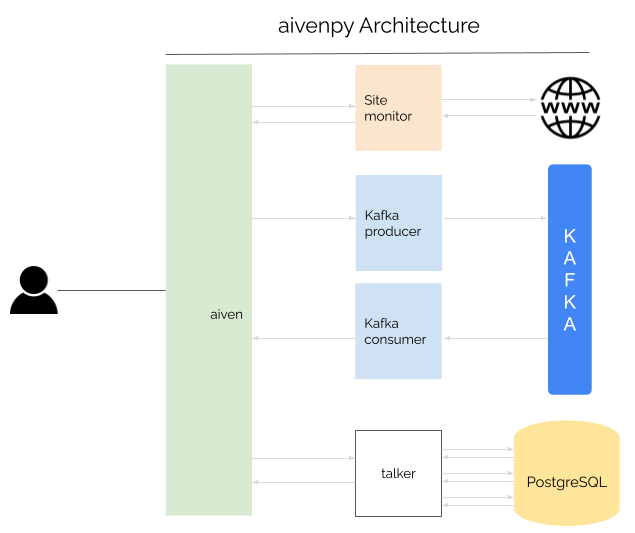

# aivenpy

aivenpy is a python-based site monitoring system that uses [Aiven for PostgreSQL](https://aiven.io/postgresql) and [Aiven for Apache Kafka](https://aiven.io/kafka) to:

- Monitor any website
- Check - using regular expression - if a particular item is present on the site
- Publish website health stats (response_code, response_time etc) to Kafka
- Receive stats from Kafka and insert to database


>   **Before proceeding futher**
>
>   The kafka producer code is already scheduled to run every 10 minutes (see https://github.com/briwoto/aivenpy/actions). So, if you plan to run this project on your local machine, you only have to start the consumer to receive the messages from kafka and insert them to the database

## Contents
1. [Framework](#Framework)
2. [How to run the project](#How-to-run-the-project)
    1. [Pre-requisites](#Pre-requisites)
    1. [Run aivenpy](#Run-aivenpy)
        1. [Running through Docker](#Running-through-Docker)
        1. [Running code through python](#Running-code-through-python)
1. [Project Architecture](#Project-Architecture)
    1. [Details](#Details)
1. [Code flow](#Code-flow)
1. [Added bonus: Github actions pipeline](#Added-bonus-Github-actions-pipeline)
1. [Advantages of the project implementation](#Advantages-of-the-project-implementation)
1. [Tests](#Tests)
1. [If I had more time](#If-I-had-more-time)
1. [Contact](#Contact)

## Framework
For development: I utilized the open-source libraries instead of using full-fledged frameworks like Django or flask. And focused on code-clarity and clean-architecture

For testing: I used [pytest framework](https://docs.pytest.org/)

## How to run the project
### Pre-requisites
### For running through Docker
If you simply want to run the project without knowing about the mechanics of it, [installing docker](https://www.docker.com/get-started) would be sufficient

### For manual run on your local
If you want to run the code yourself on your local machine, you would need the following pre-installed on your system :

- [python](https://www.python.org/) 3.7 or higher
- [venv](https://docs.python.org/3/library/venv.html) or any other virtual environment for python

### Common pre-requisites for both the methods
Regardless of the above two methods, you would need the values of the following environment variables:
```
- AVDATABASE
- AVHOST
- AVPASSWORD
- AVPORT
- AVUSER
- AV_BASE_URL
- AV_KFUSER
- AV_KFPASSWORD
- AV_KFPORT
- BOOTSTRAP_SERVER
- CA_PEM
```
### **Run aivenpy**
- #### Step 1: Clone repo
    First you need to clone the repo to your local

    - Clone with SSH:
        ```
        git@github.com:briwoto/aivenpy.git
        ```
        OR

    - Clone with HTTPS:
        ```
        https://github.com/briwoto/aivenpy.git
        ```
- #### **Step 2: Setting envionment variables**
    >NOTE: This step below for setting environment variables, is for Mac/Linux. If you are using Windows then, please google the steps to set the environment variables in Windows

    > If you need the env vars to run the project, feel free to Contact Me

- #### **Important**
    The authentication method used for Kafka is `SASL_SSL PLAIN`. 
So you need a pem file in addition to the credentials 
(notice the `CA_PEM` variable mentioned in pre-requisites).

    Aiven kafka provides a `ca file`, which you have to convert to a `pem` file and 
save the value of the file in an environment variable

    1. First, you have to convert the crt to a pem file. You can use this link for referernce:

        [How to get .pem file from .key and .crt files?](https://stackoverflow.com/questions/991758/how-to-get-pem-file-from-key-and-crt-files)

    1. Once you have the .pem file, open the file in any text editor and 
   copy the contents and paste is as the value of the CA_PEM environment variable. 
   You can use this linke for reference:

        [How to Export a Multi-line Environment Variable in Bash/Terminal e.g: RSA Private Key](https://stackoverflow.com/questions/49457787/how-to-export-a-multi-line-environment-variable-in-bash-terminal-e-g-rsa-privat)

#### **Running through Docker**
If you want to run the project via Method A i.e. docker, follow these steps:

- **Build image**

    Run the command:
    ```
    docker build -t consumer .
    ```
- **Run container**

    Add values to the corresponding env vars below and run the command
    ```
    docker run -it \
    -e AVDATABASE="" \
    -e AVHOST="" \
    -e AVPORT="" \
    -e AVUSER="" \
    -e AVPASSWORD="" \
    -e AV_BASE_URL="" \
    -e AV_KFUSER="" \
    -e AV_KFPASSWORD="" \
    -e AV_KFPORT="" \
    -e BOOTSTRAP_SERVER="" \
    -e CA_PEM="" \
    consumer
    ```
#### **Running code through python**
If you want to run the project via Method B i.e. directly through python, first make sure that all the pre-requisites mentioned above, are fulfilled. Then, follow these steps:

- **Copy env vars to bashrc**

    Open a terminal tab/window and run the command
    ```
    sudo nano /etc/bashrc
    ```
    The terminal might ask for a password. If it does, type the password and press Enter. Once the bashrc file opens, export all the environment variables with the correct values

    Example:
    ```
    export AVUSER=dummyname
    export AVPASSWORd=whateveryourpasswordis
    ...
    ...
    ```
    Save the bashrc file and open a new terminal window

- **Create and activate a virtual environment**

    Run this command to create a virtual environment
    ```
    python3 -m venv venv
    ```
    Then, run this command to activate the virtual environment
    ```
    source venv/bin/activate
    ```
- **Install dependencies**

    Run this command to install all dependencies
    ```
    pip install -r requirements.txt
    ```
- **Run aiven** 
    If you want to get fresh stats from the websites and publish to the kafka producer, run:
    ```
    make run_aiven
    ```
    If you want to run kafka consumer, run:
    ```
    make start_consumer
    ```
## Project Architecture


### Details
The project consists of 3 layers:

> 1. The **Interactive layer** says "what" to do
> 2. The **Business layer** decides "how" to do it
> 3. The **Service layer** decides "where" to go to get/update data

#### **1. Interactive layer**
Interactive layer is the entry point of the project. This is the layer that:

- Interacts with the site monitor
- Tells kafka producer (business layer) to send data to Kafka (service layer)
- Starts the consumer
- Send messages from consumer to the database

> Any interaction with a business layer component, is done at this layer.
>
> Any interaction between two business layer components, is also done at this layer

#### **2. Business layer**
This layer is the backbone of the project. All logic, data extraction, manipulation happens at this layer. The interactive layer tells what to do. The business layer decides "how" to do it

#### **3. Service layer**
This layer is nothing, but the connection with in-house/third-party services to get/update what we need.

## Code flow
The entry script for the project is `aiven.py`. 
There are two separate executions that can be done through this file:

1. Execute site-monitor alongwith kafka producer
2. Start kafka consumer
---
### Site-monitor and kafka producer
When you direcly run 
```
python aiven.py
```
the code for `site-monitor` and `producer` is executed. The sequence of code execution is as follows:

1. First, aiven.py calls the `config` module. The `pem` file is updated here. 
   Also the `logger` library, which is used in all the programs 
   to log info/warning to the console, is initiated
2. Then, aiven calls the `monitor` module to get the stats of the target website. 
   The target website URL, as of now, is stored in the `AV_BASE_URL` env var
3. Other than checking the stats, the code also checks for a regular expression 
   to verify whether a particular item is present in the response.text
4. Upon receiving the stats and the `regexp` boolean value, aiven.py sends these stats 
   to the producer

### Start kafka consumer
When you want to start the consumer, the `start_consumer()` function in aiven.py needs to be run separately, This is taken care by the make command:
```
make start_consumer
```

- Once kafka consumer is called, the messages are received by *aiven.py*
- Each message - when received - is then formatted via `consumer_queries` module
- Once formatted, the data is then inserted in the database
#### **The 'talker' module**
With the intent of keeping the architecture clean and isolating each layer, 
the talker module was created. Any interaction that needs to happen with the database,
happens via the talker module.

## Added bonus: Github actions pipeline
Instead of looping with a `while` statement to get stats periodically, I set up a github actions pipeline.

As of now, the site monitor is completely automated. The stats are collected every 10 minutes via the github actions pipeline. This means that, every 10 minutes:

- A request is sent to the target website
- The collected stats are sent to Kafka

Visit the below link to view the status of each build: 
  
https://github.com/briwoto/aivenpy/actions

## Advantages of the project implementation
- Although I can't claim the project to be "100% clean", the focus while writing the code was towards clean architecture. For instance:
    - `talker.py` module focuses on the part that: The database service should be a plug-and-play. Suppose in the future, we decide to move from Postgres to any other database or move from on-prem to cloud services, we should only need to create the new connections without touching any of the existing code

    - Every package at every layer is basically an app in itself. This provides an opportunity to enhance the project where producer | consumer | database : all sit in different systems

## Tests
The test suite is divided into 3 test files:

1. test_producer
1. test_db
1. test_site_monitor

The tests are very basic at this point. The coverage is at a unit-test level. Because of lack of time and the sake of completion, I could not write detailed integration tests

## If I had more time
- I would like to spin-off the project into different sub-projects, to "completely" isolate each app

- **Bug**

    The logger logs the same output twice, in the console. Couldn't get time to fix this. I confirmed, however, that the data in the database is not getting duplicated. The issue is only with the logger function

- Seggregate the talker module into sub-modules; where one module would be responsible to format the data and another module would be responsible to send this data to postgres.py db layer

- Start the consumer automatically. As of now, we have to clone the project and start the consumer

- Include a broader set of tests if I could spend more time on the project

- Fetch list of target websites from the DB too. I have created a table called `sites`. It contains the site `url` as well as the `regexp` that we would like to verify. In this table, we can store all the target websites and then check status of each one of them

- Implement `outbox`:

    The idea here is to

    - Take the stats and insert in the `outbox` table. Also add `topic_name` to this data, 
      and a boolean flag that tells whether the data has been published to kafka or not
    
    - Create a common producer app that runs periodically: fetches the unpublished data from `outbox` and sends the data to kafka 
      
    - Finally, update the boolean flag in the outbox table to indicate that 
      data has been sent to kafka

    This approach is highly scalable when we have multiple apps and each app has its own kafka topic to send data to. Following the outbox approach, there won't be a need for each team to implement a code for kafka producer. Since the outbox table will contain a column called `topic_name`, we can have one single producer that (a) picks up data from outbox and sends it to kafka; and (b) updates the boolean flag for that row in the table, to indicate that data has been sent

## Contact
If you would like to talk more about the project and its architecture - or if you face any issues while running it - feel free to contact me (email id mentioned below)

With best regards,

Rahul Singh

`rahul.beck@gmail.com`